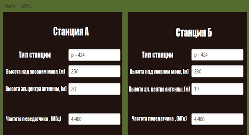
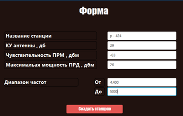
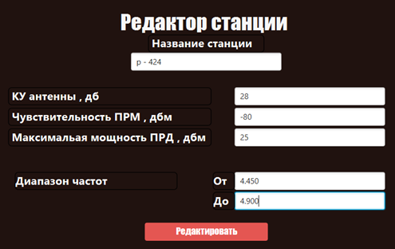
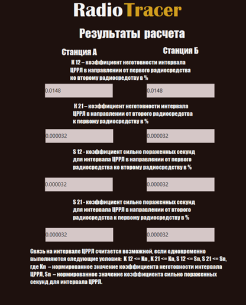

# Radio Relay Station Manager (Graduation Project)

This is a JavaFX desktop application developed as my graduation project at the Military Academy of Belarus.  
The application is designed to assist in the configuration and calculation of radio relay line (RRL) parameters.

## 📋 Description

The program allows users to:
- Add, edit, and delete radio relay stations
- Input station parameters such as:
  - Antenna gain
  - Receiver sensitivity
  - Transmitter power
  - Frequency range
- Save and reuse data from `.txt` files
- View calculation results directly in the UI

This tool was created to simplify and automate the process of calculating relay routes based on the "Muskat" algorithm.

## 🛠 Tech Stack

- Java
- JavaFX
- FXML
- File I/O (FileWriter)
- JOptionPane
- IDE: IntelliJ IDEA

## 🧭 Interface Overview

### Main Menu

The main window is divided into:
- **Input Section** — station height, antenna height, frequency
- **Output Section** — displays the calculation results

Menu panels:
- **File:** Open map, Save map, Exit
- **RRS (Radio Relay Station):** Add station, Edit station, Delete station

### Add Station

Users can enter a new station's:
- Name
- Antenna gain (dB)
- Receiver sensitivity (dBm)
- Transmitter power (dBm)
- Frequency range

The data is saved to a `.txt` file and reused for future calculations.

### Edit Station

Existing stations can be modified and saved again to the same `.txt` file.

### Delete Station

Enter a station name to remove it from stored data.

### Calculation Results

All calculations are displayed in a separate results window.  
If a station was already calculated and saved, it can be reloaded without repeating the calculations.

## 🖼 Screenshots

### Main Menu  


### Add Station  


### Edit Station  


### Calculation Results  


### Delete Station  


> ⚠️ Note: The application interface is in Russian, as it was originally developed and defended as part of a graduation project at a military academy in Belarus.


## 📁 Project Structure

```bash
src/sample/
├── Main.java
├── Controller.java
└── Form.java

resources/sample/
├── sample.fxml
└── Form.fxml

images/
├── main-menu.png
├── add-station.png
├── edit-station.png
└── results.png
```


## 🧠 About This Project

This was a personal graduation project, fully developed by me.  
I independently studied Java and JavaFX to complete the implementation, based on the "Muskat" algorithm for relay network calculations.  
Although I now focus on Python and web development, this project demonstrates my ability to:
- Learn independently
- Build desktop software from scratch
- Design and implement user-friendly interfaces
- Handle file operations and user interaction

>🔒 Due to military confidentiality, the detailed implementation of the "Muskat" algorithm used for radio relay line calculations is not available in this repository. This project was developed during my studies at a military academy and includes only the user interface and data entry components.

## ✅ Conclusion

This application solves a time-consuming engineering task — calculating radio relay lines for military stations.  
Using the Java programming language and the IntelliJ IDEA development environment, I was able to automate the process of telecom route planning and reduce calculation time.

## 👤 Author

**Yahor Miarzlou**  
[github.com/MeloRegon](https://github.com/MeloRegon)
